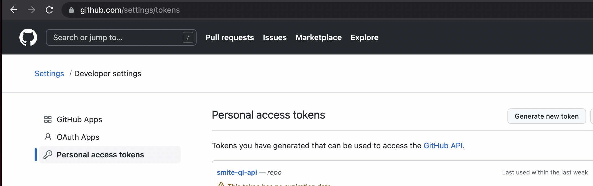
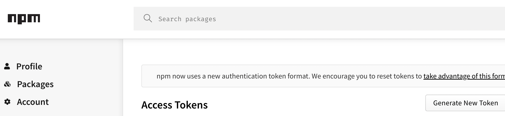
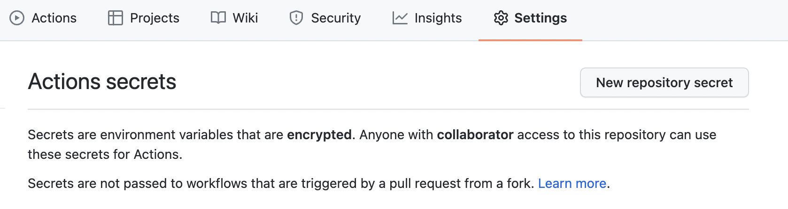

# Semantic Release

## Instructions

#### 1. Install packages

```sh
# Install base package
npm i semantic-release

# Install git to trigger a buildmaster commit
npm i @semantic-release/git
```

### 2. Add release `release.config.js`

```javascript
module.exports = {
  branches: ['master'],
  plugins: [
    '@semantic-release/commit-analyzer',
    '@semantic-release/release-notes-generator',
    '@semantic-release/npm',
    '@semantic-release/github',
    [
      '@semantic-release/git',
      {
        assets: ['package.json', 'package-lock.json'],
        message: 'semantic-release: ${nextRelease.version}',
      },
    ],
  ],
};
```

### 3. Create github tokens

#### 1. [Create a Personal Access Token (from github)](https://github.com/settings/tokens)



#### 2. Create NPM token at `https://www.npmjs.com/settings/<username>/tokens`



#### 3. Apply tokens to project at `https://github.com/<github-username>/<repo>/settings/secrets/actions`



#### 4. The following tokens are required for this project:

```
# for Smite QL API
AUTH_KEY
DEV_ID

# for semantic release
NPM_TOKEN
GH_TOKEN
```

`GH_TOKEN` and `GITHUB_TOKEN` are automatically made by the repository

### 4. Update `package.json`

Add `private: true` to your package json to stop semantic release from publishing to NPM on every release.

```json
{
  "private": true
}
```

### 5. Add github workflow

```yml
name: Update Semantic Version

on:
  push:
    branches:
      - master

jobs:
  release:
    name: Release
    env:
      GH_TOKEN: ${{ secrets.GH_TOKEN }}
    runs-on: ubuntu-latest
    steps:
      - name: Checkout
        uses: actions/checkout@v3
        with:
          # Make sure the release step uses its own credentials.
          persist-credentials: false
      - name: Install Node 16
        uses: actions/setup-node@v2
        with:
          node-version: '16.x'
      - name: Install Dependencies
        run: npm ci
      - name: Run Semantic Release
        run: npx semantic-release
        env:
          GITHUB_TOKEN: ${{ secrets.SEMANTIC_RELEASE_TOKEN }}
          NPM_TOKEN: ${{ secrets.NPM_TOKEN }}
```
